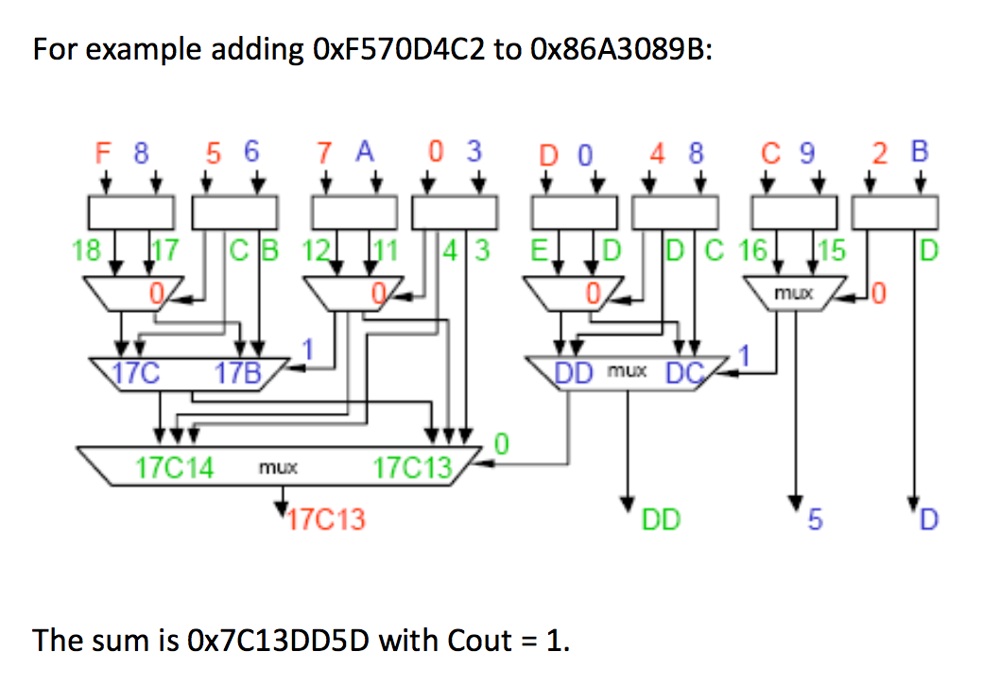
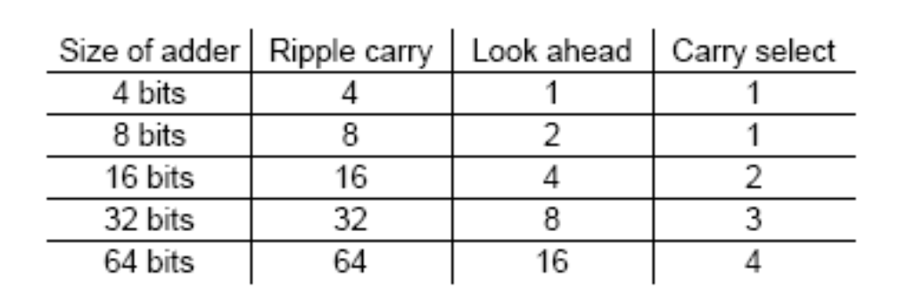

# 不负责任的考点猜想

Instructions:
add/sub
branch
load/store

# Cache Memory

a small fast on chip memory that holds the most recently accessed data from the main memory.

- **Temporal locality** occurs because data accessed once
is likely to be accessed again soon
- **Spatial locality** occurs because data from one memory location is likely to be accessed if data in an adjacent memory location has recently been accessed.

# Addressing Modes

### Register Addressing

the instruction code includes a number (or numbers) that identifies a register (or registers).

`ADD r3, r1, r2`

### Immediate Addressing

the instruction code contains a value to be used.

`MOV r12, #0xA0`

### Indirect Addressing

uses a value in a register to identify a memory address

`LDR r1, [r6]`

### Base plus offset addressing

uses a value in a register (the ‘base’) plus a binary number (the ‘offset’) to identify a memory address.

`LDR r6, [r11, #12]`

# Endian

### Little endian

the least significant byte (‘the little end’) is stored at the lowest memory address

### Big endian

the most significant byte (‘the big end’) is stored at the lowest address.

# Indexing

### Pre-indexing

`LDR r6, [r11, #12]!`

is an example of **pre-indexing**, meaning that `12` to added to the base register, `r11`, before it is used as a memory address.

### Post-indexing

`LDR r6, [r11], #12`

is an example of **post-indexing**, meaning that `12` is added to the base register, `r11`, after it is used for the memory address.

### Automatic updating

`LDR r6, [r11, #12]!`

does the same as `LDR r6, [r11, #12]`, **but `12` is added to the value in `r11`**.

#### `!` 'pling'

# RAM

### Dynamic RAM

a type of RAM that stores each bit of data in a separate tiny capacitor within an intergrated circuit.

**It must be refreshed every few milliseconds**.

### Static RAM

a type of memory that uses bistable latching circuitry to store each bit.

**It does not need to be refreshed**, and the data stored in a SRAM memory will be retained
as long as it is connected to a power supply.

SRAM is **generally faster than DRAM** but needs a greater surface area of silicon (means **more expensive**) to store the same amount of data.

# ROM

Read-only memory

### PROM
- Programmable ROM (PROM) could be electrically programmed once only and then the contents were fixed.

### EPROM
- Erasable PROM (EPROM) could also have its contents erased by exposure to ultraviolet (UV) light and could then be reprogrammed.

### EEPROM
- Electrically erasable PROM (EEPROM) could have its contents erased by an electrical signal.

### FEPROM
- Flash Erasable PROM (FEPROM or flash memory) is similar to EEPROM but erasing could only be done over a significant part of (maybe all) the integrated circuit.

# Input & Output

Memory mapped input ports and output ports are assigned a memory address and
- A register load from that address is equivalent to an input.
- A register store to that address is equivalent to an output.

# Carry select

For a 32 bit adder there are **a maximum of 3 propagation delays** in the carry path.

### Performance

### Subtraction
using twos complement, an adder will perform subtraction. Or use ones complement and set ‘carry-in’ to logic 1.

# Booth's Algorithm

### Example

A: Running total
B: Shifted multiplicand

...
